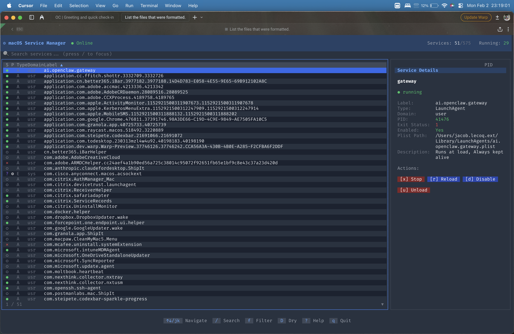

# macOS Service Manager TUI

[](LICENSE)
[](https://bun.sh)
[](https://www.typescriptlang.org/)

A powerful **Terminal User Interface (TUI)** for inspecting and managing macOS system services, including LaunchDaemons, LaunchAgents, and System Extensions.

Built with [OpenTUI](https://github.com/anomalyco/opentui), [React](https://react.dev/), and [Zustand](https://zustand-demo.pmnd.rs/).

<p align="center">
  
</p>

## ✨ Features

### 🔍 Service Discovery

- **Comprehensive listing** of all LaunchDaemons, LaunchAgents, and System Extensions
- **Smart categorization** by type, domain (system/user/gui), and status
- **Rich metadata** including PID, exit status, plist path, and descriptions
- **Automatic detection** of Apple/macOS services vs third-party services

### ⚡ Service Management

- **Start/Stop** services with a single keypress
- **Enable/Disable** services to control auto-start behavior
- **Reload** running services to pick up configuration changes
- **Unload** services completely from launchd
- **Dry-run mode** to preview commands before execution
- **Smart privilege handling** with sudo when required

### 🎨 Modern UI/UX

- **Vim-style navigation** (`j`/`k`, `g`/`G`)
- **Fuzzy search** with match highlighting
- **Collapsible filter bar** with multiple criteria
- **Real-time status updates** with auto-refresh
- **Responsive layout** adapts to terminal size
- **Visual status indicators**:
  - `●` Running (green)
  - `○` Stopped (gray)
  - `◌` Disabled (yellow)
  - `✕` Error (red)
  - `🔒` SIP-protected
  - `🛡` Immutable
  - `⚙` System-owned

### 🛡️ Safety First

- **Confirmation prompts** for destructive actions
- **Clear protection indicators** for SIP and immutable services
- **Offline mode** with graceful degradation
- **Command validation** to prevent injection attacks

## 📦 Installation

### Prerequisites

- [Bun](https://bun.sh/) v1.0 or later
- macOS 11+ (Big Sur or later)

### Quick Start

```bash
# Clone the repository
git clone https://github.com/HexSleeves/macos-service-manager-tui.git
cd macos-service-manager-tui

# Install dependencies
bun install

# Run the application
bun run dev
```

### One-liner

```bash
bunx macos-service-manager  # Coming soon to npm!
```

## ⌨️ Keyboard Shortcuts

### Navigation

| Key | Action |
| --- | ------ |
| `↑` / `k` | Move selection up |
| `↓` / `j` | Move selection down |
| `g` | Go to first service |
| `G` | Go to last service |
| `PgUp` / `PgDn` | Page up/down |
| `Tab` | Switch panel focus |

### Search & Filter

| Key | Action |
| --- | ------ |
| `/` | Focus search |
| `Esc` | Clear search / Cancel |
| `f` | Toggle filter panel |
| `1-4` | Filter by type (All/Daemon/Agent/Extension) |
| `[` | Cycle domain filter (All/System/User/GUI) |
| `]` | Cycle status filter (All/Running/Stopped/Disabled/Error) |
| `a` | Toggle Apple services visibility |
| `p` | Toggle protected services visibility |

### Sorting

| Key | Action |
| --- | ------ |
| `s` | Cycle sort field (label/status/type/domain/pid) |
| `S` | Toggle sort direction (asc/desc) |

### Service Actions

| Key | Action |
| --- | ------ |
| `↵` Enter | Start service (if stopped) |
| `x` | Stop service |
| `r` | Reload service |
| `d` | Toggle enable/disable |
| `u` | Unload service |

### General

| Key | Action |
| --- | ------ |
| `R` | Refresh service list |
| `Shift+A` | Toggle auto-refresh |
| `Shift+D` | Toggle dry-run mode |
| `?` | Toggle help panel |
| `q` / `Ctrl+C` | Quit |

## 🏗️ Architecture

```bash
src/
├── index.tsx                 # App entry point
├── constants/                # UI constants (colors, dimensions)
├── store/                    # Zustand state management
│   ├── useAppStore.ts        # Main store with state + actions
│   ├── useAppEffects.ts      # Side effects (auto-refresh, reconnect)
│   └── useDerivedState.ts    # Computed selectors
├── hooks/
│   └── useKeyboardShortcuts.tsx  # Keyboard event handling
├── components/               # React/OpenTUI components
│   ├── ServiceList.tsx       # Virtual scrolling list
│   ├── ServiceDetails.tsx    # Detail panel with actions
│   ├── FilterBar.tsx         # Filter controls
│   └── ...                   # Header, Footer, dialogs
├── services/                 # macOS service integration
│   ├── launchctl/            # launchctl parsing & execution
│   ├── systemextensions.ts   # System extensions
│   ├── plist.ts              # Plist file parsing
│   └── mock.ts               # Mock data for development
└── utils/                    # Utilities (fuzzy search, retry)
```

## 🔧 Development

### Commands

```bash
bun install          # Install dependencies
bun run dev          # Run with hot reload
bun run typecheck    # TypeScript type checking
bun run check        # Lint and format (Biome)
bun test             # Run tests
```

### Running on Non-macOS

The app automatically uses mock data on non-macOS systems, allowing development and testing on any platform.

### Tech Stack

- **Runtime**: [Bun](https://bun.sh/) - Fast JavaScript runtime
- **UI**: [OpenTUI](https://github.com/anomalyco/opentui) - React reconciler for terminals
- **State**: [Zustand](https://zustand-demo.pmnd.rs/) - Lightweight state management
- **Language**: TypeScript (strict mode)
- **Linting**: [Biome](https://biomejs.dev/) - Fast formatter and linter

## 🔐 Security

### System Integrity Protection (SIP)

- Services in `/System/Library/` are protected by SIP
- The app clearly indicates protected services with 🔒
- Actions on SIP-protected services are blocked

### Root Privileges

- System-level services require administrator privileges
- The app indicates when `sudo` is required
- Passwords are never stored or logged

### Immutable Services

- Critical system services (e.g., `com.apple.launchd`) cannot be modified
- These are marked with 🛡 and actions are disabled

## ⚠️ Known Limitations

1. **System Extensions** cannot be started/stopped directly - use System Settings or the parent app
2. **Full Disk Access** may be required to read some plist files
3. **Actions may fail** if:
   - User cancels sudo authentication
   - Service is in an invalid state
   - SIP prevents modification

## 🗺️ Roadmap

- [ ] Service log viewer (`log show --predicate`)
- [ ] Mouse support (click to select, scroll wheel)
- [ ] Service dependency visualization
- [ ] Batch operations on multiple services
- [ ] Homebrew formula (`brew install macos-service-manager`)
- [ ] Standalone binary distribution

See [docs/TODO.md](docs/TODO.md) for the full task list.

## 🤝 Contributing

Contributions are welcome! Please:

1. Fork the repository
2. Create a feature branch (`git checkout -b feature/amazing-feature`)
3. Run checks (`bun run typecheck && bun run check && bun test`)
4. Commit your changes (`git commit -m 'feat: add amazing feature'`)
5. Push to the branch (`git push origin feature/amazing-feature`)
6. Open a Pull Request

### Commit Convention

We use [Conventional Commits](https://www.conventionalcommits.org/):

- `feat:` - New features
- `fix:` - Bug fixes
- `refactor:` - Code restructuring
- `docs:` - Documentation changes
- `test:` - Test additions/changes

## 👤 Author

**HexSleeves**

- GitHub: [@HexSleeves](https://github.com/HexSleeves)

## 📄 License

This project is licensed under the MIT License - see the [LICENSE](LICENSE) file for details.

## 🙏 Acknowledgments

- [OpenTUI](https://github.com/anomalyco/opentui) - Terminal UI framework for React
- [Zustand](https://github.com/pmndrs/zustand) - State management
- [rakhesh.com](https://rakhesh.com/mac/macos-launchctl-commands/) - launchctl reference
- Apple Developer Documentation

---

<p align="center">
  Made with ❤️ for the macOS community
</p>
